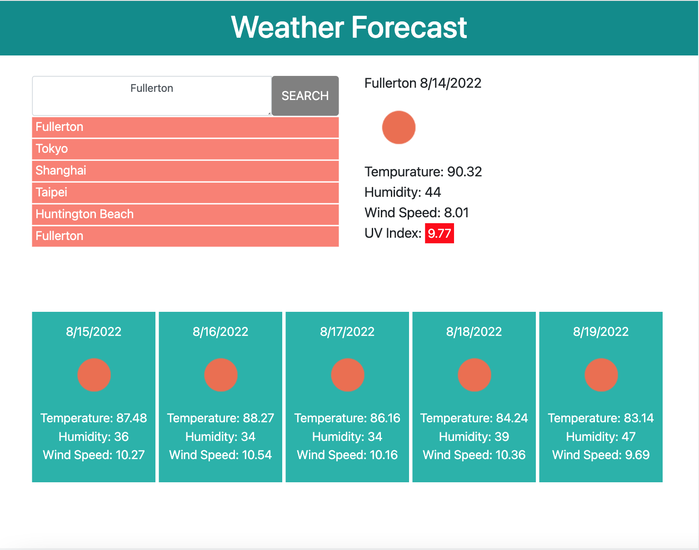

# C06_Weather

## Description
- This challenge was to create a weather forecasting application using the Open Weather API.

## Functionality
  - The user is able to input just about any city in the world to get weather data.
  - When the user inputs a city and selects search..
    - The city is captured into localStorage and appended to the list of previously selected cities below
    - The current weather data - temp, humidity, wind speed, & UV index are shown under the city name and current data as well as an icon to represent the current weather forecast.
      - The UV index will display different colors based on the following values to indicate severity:
        - < 3 - Green
        - < 6 - Yellow
        - > 6 - Red
    - The five day forecast is also populated with the date, temp, humidty, and windspeed.

## Notes
    - Currently, within the app are a few issues that need to be addressed..
        - 1. Local Storage does not seem to retain values consistently. When refreshing the page, the list of previously selected cities will not completely persist.
        - 2. The list of previously selected cities will continue out of it's div indefinitely. Upon refreshing the page, the list will the shorten.
        - 3. When selecting a previously selected city, the user must be at a state where the placeholder text is visible. If the user has input a value into the search bar, the previously selected city will not populate into the search bar.

### Website

### Links
[Weather Forecast](https://ahuang23.github.io/C06_Weather/)